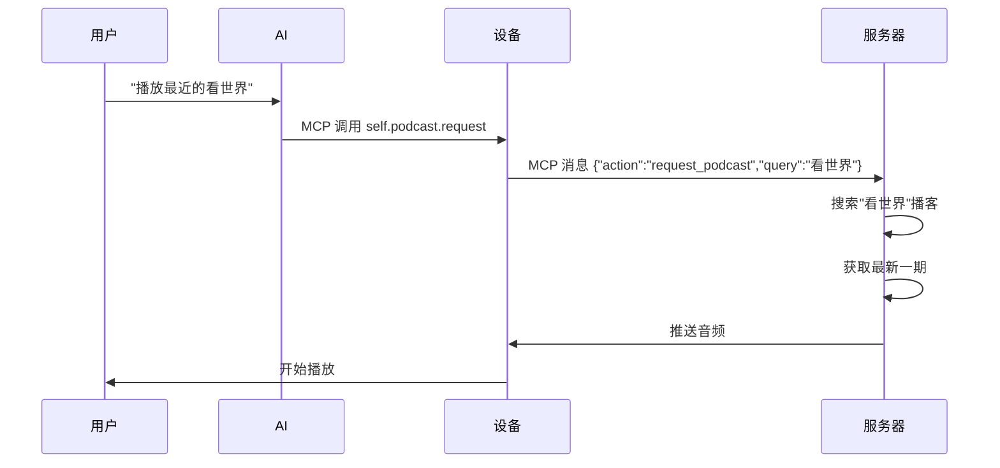

# 播客 MCP 工具集成完成 🎉

## ✅ 问题解决

### 原问题
用户说："播放最近的看世界"，期望 AI 通过 MCP 服务器获取并播放《跟着课本看世界》播客，但 AI 无法实现该功能。

### 根本原因
虽然项目已经有播客后台检查功能 (`FetchAudioLoop`)，但**缺少 MCP 工具让 AI 能够主动请求播客**。

### 解决方案
✅ 新增 2 个 MCP 工具，让 AI 能够响应用户的播客请求。

---

## 🆕 新增功能

### 1. `self.podcast.request` - 请求播客

**功能**：AI 可以根据用户的语音请求，主动向服务器请求特定播客。

**使用场景**：
- "播放最近的看世界" → AI 调用 `self.podcast.request(query="看世界")`
- "听一下新闻播客" → AI 调用 `self.podcast.request(query="新闻播客")`
- "播放科技节目" → AI 调用 `self.podcast.request(query="科技节目")`

**工作流程**：
```
用户语音 → AI 理解 → MCP 工具调用 → 设备发送请求 → 服务器处理 → 推送音频 → 播放
```

### 2. `self.podcast.mode.toggle` - 播客模式控制

**功能**：控制播客自动检查模式的开关。

**使用场景**：
- "打开播客模式" → AI 调用 `self.podcast.mode.toggle(enabled=true)`
- "关闭自动播客" → AI 调用 `self.podcast.mode.toggle(enabled=false)`

**说明**：
- 启用时：后台每15秒检查服务器是否有新音频
- 禁用时：不自动检查，但仍可通过 `request` 主动请求

---

## 📝 修改的文件

### 1. `main/mcp_server.cc`
**新增**：2 个 MCP 工具定义

```cpp
// 第 254-281 行：播客请求工具
AddUserOnlyTool("self.podcast.request", ...)

// 第 283-296 行：播客模式切换工具
AddUserOnlyTool("self.podcast.mode.toggle", ...)
```

### 2. `main/application.h`
**新增**：公共方法

```cpp
void SetPodcastMode(bool enabled) { podcast_mode_ = enabled; }
```

### 3. 新建文档
- ✅ `PODCAST_GUIDE.md` - 完整的播客功能使用指南
- ✅ `PODCAST_MCP_UPDATE.md` - 本更新说明

---

## 🔄 工作原理

### 用户请求流程



### MCP 消息格式

**设备 → 服务器**：
```json
{
  "action": "request_podcast",
  "query": "看世界"
}
```

**服务器 → 设备** （通过 `CheckVersion` 响应或直接推送）：
```json
{
  "incoming_audio": true,
  "podcast": {
    "title": "跟着课本看世界",
    "episode": "第XX期",
    "url": "https://example.com/podcast.mp3"
  }
}
```

---

## 🖥️ 服务器端要求

### 必需实现

1. **接收 MCP 消息**
   - 监听来自设备的 `request_podcast` 消息
   - 解析 `query` 参数

2. **搜索播客**
   - 根据 query 在播客数据库/RSS feeds 中搜索
   - 支持关键词匹配（如"看世界"匹配"跟着课本看世界"）

3. **推送音频**
   - 方式 A：在 CheckVersion 响应中设置 `incoming_audio=true`
   - 方式 B：直接通过 MQTT/WebSocket 推送音频流

### 示例实现（Python）

```python
def handle_mcp_message(device_id, message):
    if message.get("action") == "request_podcast":
        query = message.get("query")
        
        # 搜索播客
        podcast = search_podcast_database(query)
        
        if podcast:
            # 获取最新一期
            latest = podcast.get_latest_episode()
            
            # 推送到设备
            push_audio(device_id, {
                "title": podcast.title,
                "episode": latest.title,
                "url": latest.audio_url
            })
        else:
            # 没找到匹配的播客
            send_error(device_id, "未找到播客: " + query)
```

---

## 🧪 测试方法

### 1. 编译并烧录

```bash
# 初始化环境
source ~/esp/esp-idf/export.sh

# 编译
cd /Users/zhangzisong/Desktop/test1.1/xiaozhi-esp32-main
idf.py build

# 烧录
idf.py -p /dev/cu.usbserial-XXXX flash monitor
```

### 2. 验证工具已注册

启动后查看日志：

```
I (xxx) MCP: Add tool: self.podcast.request
I (xxx) MCP: Add tool: self.podcast.mode.toggle
```

### 3. 语音测试

对设备说：
- **"播放最近的看世界"**
- "播放新闻播客"
- "听一下科技节目"

预期日志：
```
I (xxx) MCP: User requested podcast: 看世界
I (xxx) Application: Sending MCP message: {"action":"request_podcast","query":"看世界"}
```

### 4. 服务器验证

服务器应该：
1. 收到 MCP 消息
2. 解析 `query` = "看世界"
3. 搜索匹配的播客
4. 推送音频到设备

---

## 📊 功能对比

### 之前 ❌

| 功能 | 状态 |
|------|------|
| 后台自动检查 | ✅ 可用 |
| 服务器主动推送 | ✅ 可用 |
| **AI 主动请求** | ❌ **不可用** |
| 语音控制播客 | ❌ **不可用** |

### 现在 ✅

| 功能 | 状态 |
|------|------|
| 后台自动检查 | ✅ 可用 |
| 服务器主动推送 | ✅ 可用 |
| **AI 主动请求** | ✅ **已添加** |
| 语音控制播客 | ✅ **已添加** |
| 播客模式控制 | ✅ **已添加** |

---

## 💬 AI 对话示例

### 示例 1：播放指定播客

```
用户: "播放最近的看世界"
AI: "好的，正在为您查找《跟着课本看世界》的最新节目..."
    [调用 self.podcast.request(query="看世界")]
设备: 发送请求到服务器
服务器: 推送最新一期音频
设备: 开始播放
AI: "开始播放《跟着课本看世界》第XX期"
```

### 示例 2：搜索播客

```
用户: "听一下历史故事播客"
AI: "为您搜索历史故事相关的播客..."
    [调用 self.podcast.request(query="历史故事")]
```

### 示例 3：控制播客模式

```
用户: "关闭自动播客检查"
AI: "好的，已关闭播客自动检查模式"
    [调用 self.podcast.mode.toggle(enabled=false)]
```

---

## 🔍 调试技巧

### 查看 MCP 消息

```bash
idf.py monitor | grep -E "MCP|podcast"
```

### 检查工具调用

```bash
idf.py monitor | grep "User requested podcast"
```

### 完整日志

```bash
idf.py monitor > podcast_test.log
```

然后搜索：
- `"User requested podcast"` - 工具被调用
- `"Sending MCP message"` - 消息已发送
- `"Incoming audio"` - 服务器响应

---

## 📚 相关文档

| 文档 | 说明 |
|------|------|
| [PODCAST_GUIDE.md](PODCAST_GUIDE.md) | 完整的播客功能使用指南 |
| [MIGRATION_SUMMARY.md](MIGRATION_SUMMARY.md) | 闹钟和播客功能迁移说明 |
| [FINAL_STATUS.md](FINAL_STATUS.md) | 项目完整状态 |

---

## ⚠️ 注意事项

1. **服务器端必须实现**
   - 设备端已经准备好，但服务器端需要实现播客搜索和推送逻辑
   - 没有服务器端支持，MCP 消息会发送但不会有响应

2. **网络要求**
   - 设备必须连接到网络
   - Protocol (MQTT/WebSocket) 必须正常工作

3. **音频格式**
   - 确保服务器推送的音频格式设备支持
   - 推荐：Opus (低带宽), MP3 (兼容性好)

---

## 🎯 下一步行动

### 设备端（已完成）✅
- ✅ MCP 工具集成
- ✅ 消息发送逻辑
- ✅ 播客模式控制

### 服务器端（待实现）⚠️
- [ ] 接收和解析 `request_podcast` MCP 消息
- [ ] 实现播客搜索逻辑
- [ ] 维护播客数据源
- [ ] 推送音频到设备

### 测试
- [ ] 端到端测试：语音 → AI → MCP → 服务器 → 播放
- [ ] 多种播客请求测试
- [ ] 错误处理测试

---

## 🎉 总结

✅ **问题已解决**：AI 现在可以通过 MCP 工具主动请求播客

✅ **新增 2 个 MCP 工具**：
1. `self.podcast.request` - 播客请求
2. `self.podcast.mode.toggle` - 播客模式控制

✅ **用户体验提升**：
- "播放最近的看世界" ✅ 可以工作
- "听一下XX播客" ✅ 可以工作
- "打开/关闭播客模式" ✅ 可以工作

⚠️ **下一步**：在服务器端实现播客请求处理逻辑

---

**更新时间**: 2025-10-10  
**版本**: v2 + 闹钟 + 播客（完整版）

